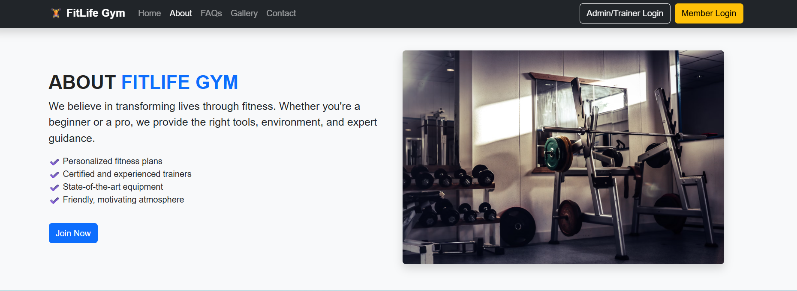
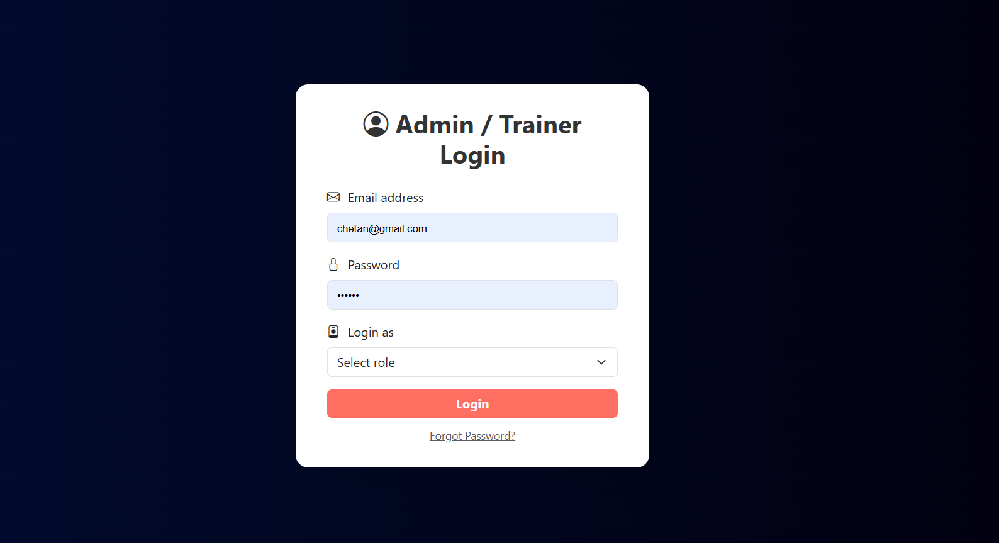
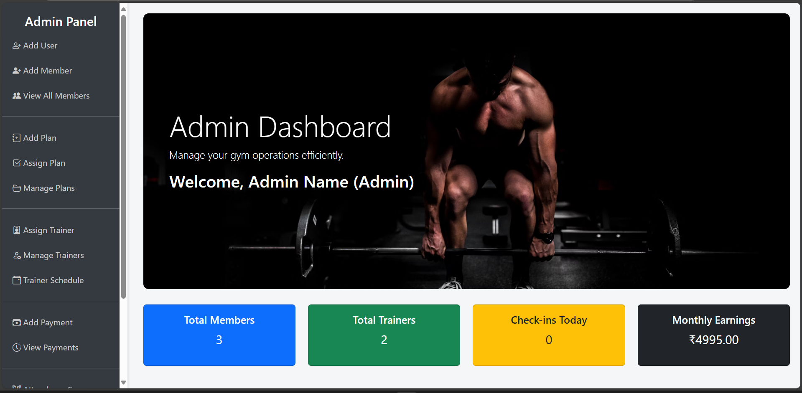
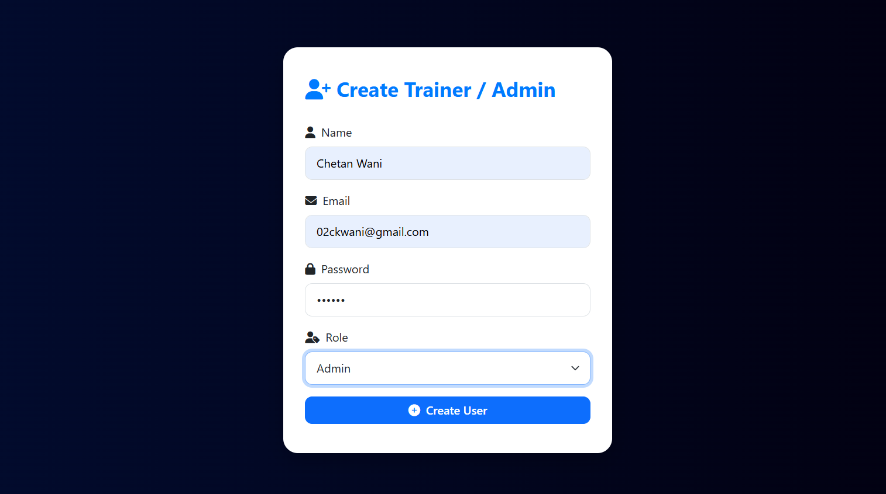
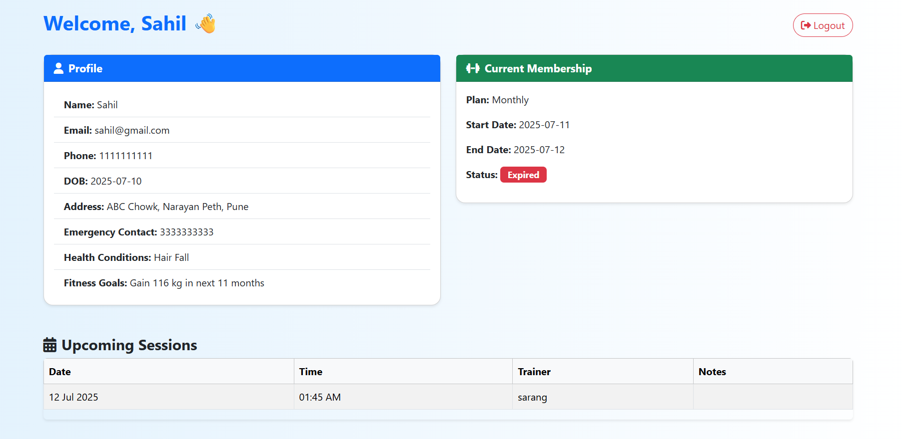
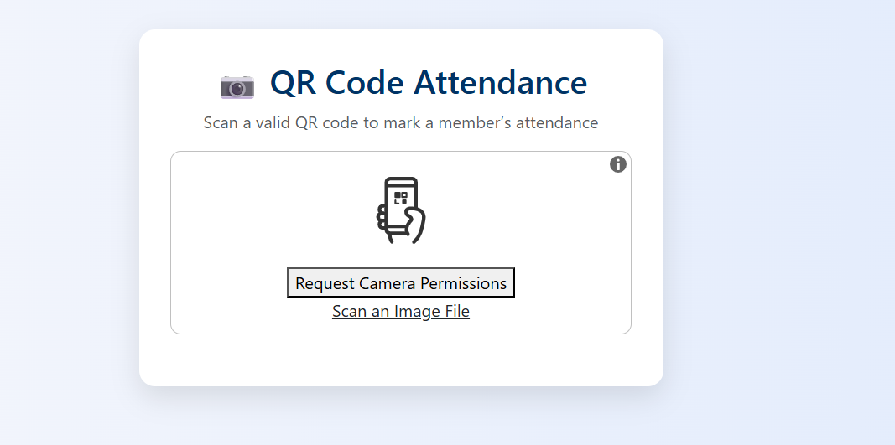
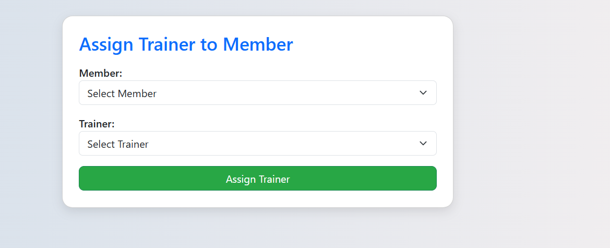
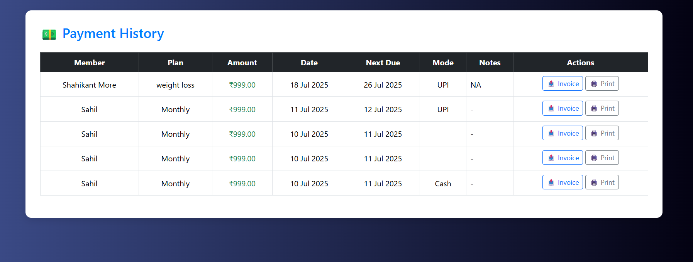
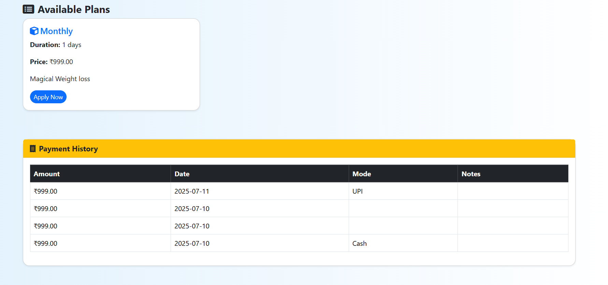

# 🏋️ Fit Life Gym – Gym Management System

**Fit Life Gym** is a full-featured web-based Gym Management System designed to streamline operations for gym owners, trainers, and members. It includes modules for user authentication, membership tracking, workout scheduling, attendance logging, and payment management.

---

## 🌐 Live Demo
- will Come soon

---

## ⚙️ Tech Stack

- **Frontend:** HTML, CSS, JavaScript, Bootstrap
- **Backend:** PHP
- **Database:** MySQL
- **Tools:** XAMPP / WAMP for local server, phpMyAdmin

---

## 🧩 Core Modules / Menu List

### 👤 Member Features
- Signup/Login
- View/Edit profile
- Membership status
- Assigned trainer and workout plan
- Attendance log
- Payment history

### 🛠️ Admin Features
- Login Dashboard
- Add/Edit/Delete Members
- Assign trainers and plans
- View attendance reports
- Manage payments and invoices
- Add/edit workout plans and class schedules
- Send announcements to members

---

## 🔗 Database Connection

The database is created in **phpMyAdmin** (MySQL).

### 📁 `db.php` Example:
```php
<?php
$host = "localhost";
$user = "root";
$pass = "";
$db = "fit_life_gym";
$conn = mysqli_connect($host, $user, $pass, $db);

if (!$conn) {
    die("Connection failed: " . mysqli_connect_error());
}
?>
````


## 🖼️ Sample Screenshots

---

### 🏠 Home Page  
A welcoming landing page for the Fit Life Gym website.


---

### ℹ️ About Page  
Displays gym details, mission, and trainer information.


---

### 🖼️ Gallery Page  
Photos of equipment, facilities, and events at the gym.


---

### 🔐 Login – Admin / Trainer  
Secure login panel for admins and trainers.


---

### 🧑‍💼 Admin Dashboard  
Powerful control panel for managing members, trainers, plans, and payments.


---

### ➕ Add Member / Trainer (By Admin)  
Admin interface to add and manage gym staff and members.


---

### 🙋‍♂️ Member Login  
Simple and secure login portal for gym members.


---

### 🏋️‍♂️ Member Dashboard  
Member’s personalized dashboard showing profile, attendance, and payments.


---

### 📲 QR-Based Attendance  
Scan-based attendance system for quick and secure check-ins.


---

### 🧑‍🏫 Trainer Assigning Members  
Trainers can view and assign workout plans to members.


---

### 💳 Payment History  
View complete transaction and membership payment history.


---

### 📋 Alternate Member Dashboard View  
Another layout for enhanced member experience and navigation.


---


## 🚀 How to Run

1. Clone or download this repository
2. Install [XAMPP](https://www.apachefriends.org/index.html)
3. Move project folder to: `C:/xampp/htdocs/`
4. Start Apache and MySQL from XAMPP
5. Open [phpMyAdmin](http://localhost/phpmyadmin) → Import `fit_life_gym.sql`
6. Visit: [http://localhost/fit\_life\_gym](http://localhost/fit_life_gym)
7. Login:

   * Admin: `admin@gmail.com` / `admin123`
   * Member: Create via signup

---

## 📁 Folder Structure

```
fit_life_gym/
├── db.php
├── index.php
├── login.php
├── signup.php
├── admin/
│   ├── dashboard.php
│   ├── members.php
│   ├── payments.php
│   └── ...
├── member/
│   ├── profile.php
│   ├── attendance.php
│   └── ...
├── css/
├── js/
├── screenshots/
└── fit_life_gym.sql
```

---

## 🧠 Future Enhancements (Ideas)

* Send SMS/email reminders
* Payment gateway integration (Razorpay/Stripe)
* PDF Invoice generation
* Android/iOS companion app

---

## 📞 Contact

- **Name**: Chetan Wani  
- **Email**: [02ckwani@gmail.com](mailto:02ckwani@gmail.com)  
- **GitHub**: [Wani-Chetan-999](https://github.com/Wani-Chetan-999)  
- **LinkedIn**: [chetan-kailas-wani](https://www.linkedin.com/in/chetan-kailas-wani/)  

---

## ☕ Support This Project – Buy Me a Coffee!

If you'd like to support my work, feel free to send a small contribution 🙌

<p><strong>UPI ID:</strong> <span style="background-color:#f0f0f0; padding:4px 10px; border-radius:6px; font-size:18px;">💳 8275540085@ibl</span></p>

<p>You can use any UPI app like <b>Google Pay</b>, <b>PhonePe</b>, or <b>Paytm</b>.</p>

Thank you for your support! ❤️


### 🎁 What You’ll Get:
- The full `db.sql` file of the Fit Life Gym system  
- My help if you get stuck using the project  
- A virtual high five 🙌

After payment, just message me at:
📧 **[02ckwani@gmail.com](mailto:02ckwani@gmail.com)**  
📩 or DM me on [LinkedIn](https://www.linkedin.com/in/chetan-kailas-wani/)

---


## 📜 License

This project is licensed under the MIT License – see the `LICENSE` file for details.
